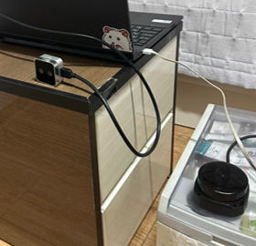

# rplidar_camera_calibration

---

2D LiDAR와 Camera calibration을 진행한 코드입니다.

Early fusion 방식을 사용하였습니다.

객체 인지 과정 없이 진행하였습니다.

main.py의 image를 YOLO를 이용한 객체 인지 image로 대체할 수 있습니다.

## 실험 환경

---

    
    

- Ubuntu 20.04
- ROS1 noetic
- RPLiDAR S2M1-R2
- Intel Realsense D405

    
    

위와 같이 라이다와 카메라를 위치시켰다.

## 사용 방법

---

1. RPLiDAR의 ros launch 이용하여 laser topic 받기

2. cam_cali.py에서 2D 좌표에 대응되는 3D 좌표 여러개 입력하기(points_2D, points_3D)

3. lidar.py를 실행시켜 laser를 point cloud 형태로 변경하기

4. main.py를 실행시켜 대응되는 point cloud를 image에 투영시키고 결과 확인하기

## 실험 과정

---

    
    

라이다를 이미지에 투영 시키는 것이 목적이다.
따라서 위와 같이 World 좌표계를 Camera 좌표계로 일치 시켜줘야한다.

라이다 좌표인 3D World 좌표를 Intrinsic, Extrinsic Parameter를 이용해서 2D image 평면에 투영시킨다. 위는 이 과정을 행렬식으로 표현한 사진이다.
따라서 Intrinsic Parameter와 Extrinsic Parameter를 구하면 된다.

### 1. Intrinsic Parameter 구하기

카메라의 내부 파라미터를 구하는 방법은 많이 알려져 있다.
OpenCV와 Checkerboard를 이용해서 구하는 방법을 코드로 작성하였다.

    
    

checkerboard를 이용해서 calibration한 결과를 시각화 한 사진

### 2. Extrinsic Parameter 구하기

카메라의 pixel 좌표와 대응되는 3D world 좌표 대응시키기
이를 solvePNP 함수를 통해서 회전행렬(R)과 변환행렬(t)를 구할 수 있다.

위와 같이 라이다에 해당하는 점을 pixel 좌표와 같이 대응시킨다.

예를 들어서 라이다에 해당하는 3D world 좌표가 (1, 2, 0)이라고 했을때 image에서 해당하는 픽셀값 (325, 127)에 대응시킨다. (숫자는 예시일 뿐이며 정확한 값은 아닙니다.)

정교한 작업이 필요하며 오차가 크게 발생할 경우 잘못된 parameter가 구해진다.

1번과 2번을 진행하면 아래와 같이 intrinsic, extrinsic parameter를 구할 수 있다.

### 3. Image에 투영시키기

앞서 언급한 식을 통해서 image 좌표를 구할 수 있다.

추가적인 작업을 통해서 image에 투영시킨다.

cv2.circle을 이용하여 원을 통하여 시각화 해주었다.

라이다와 카메라를 fusion한 결과 (Early fusion 방식)

결과가 잘 나오는 것을 확인할 수 있다. (바지가 좀 부끄럽지만.,...너무 신나서 바로 찍었습니다ㅎㅎ)

처음에는 결과가 잘못나온줄 알았으나, 카메라와 라이다의 위치 관계를 고려하면 알맞게 한 것 같다.

### 번외. Deep Learning 이용하기

---

YOLO를 이용하여 객체인지한 이미지로만 바꿔주면 완벽한 LiDAR-Camera fusion이 된다.

개인적으로 google colab보다는 kaggle을 추천한다.

Kaggle은 Tesla T4 GPU를 2개 지원해주며 이용 가능 시간도 google colab보다 긴 것으로 알고 있다.

Kaggle에서 제공하는 GPU Memory 사진

Kaggle을 이용해서 yolov8을 학습시키는 사진

### 참고자료

---

1. https://github.com/Deephome/Awesome-LiDAR-Camera-Calibration
2. https://medium.com/@shashankag14/lidar-camera-fusion-a-short-guide-34115a3055da
3. https://www.youtube.com/watch?v=XRmdUfkIu08&t=66s
